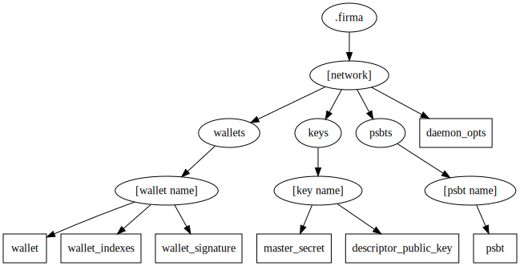

# Datadir

Firma operates saving data in a datadir which defaults to `$HOME/.firma` but could be configured.

Datadir is organized like this.

All squares are json files while circles are directories.